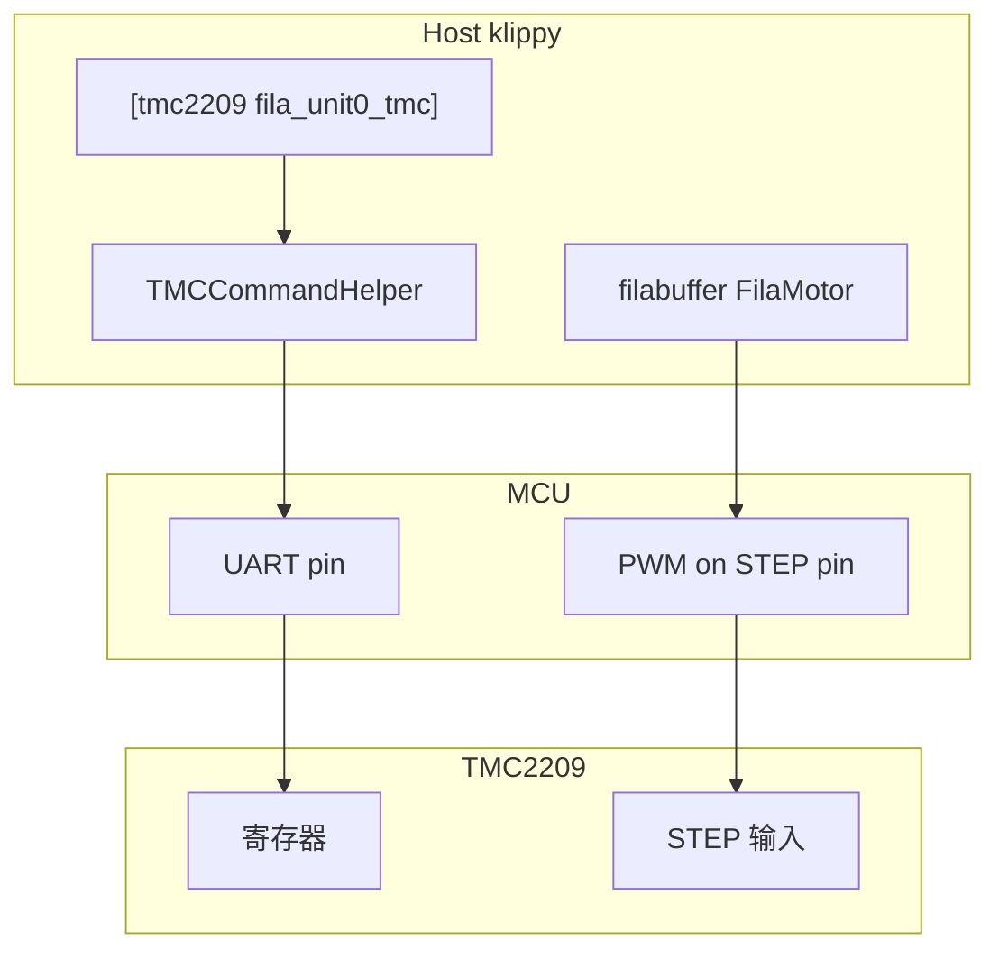

# FilaBuffer 送进电机与 TMC UART（PWM 方案）

本文说明在 [filabuffer](../klippy/extras/filabuffer.py) 使用 **PWM 控制 STEP** 时，如何与 **TMC2209 UART** 并存：UART 仅用于配置驱动器参数，送进运动不由 G-code / toolhead 步进队列驱动。

相关文件：

- 送进实现：`klippy/extras/filabuffer.py`（`FilaMotor`）
- 示例配置：`config/sample-filabuffer.cfg`、`config/sample-filabuffer-tmc.cfg`（可选 TMC 段）
- 实机测试：`docs/FilaBuffer_Test_Checklist.md`

---

## 结论摘要

| 问题 | 答案 |
|------|------|
| TMC 能否只用 UART、不接 Klipper stepper 脉冲？ | **硬件可以**；UART 写寄存器，与 STEP 来源无关。 |
| Klipper 能否只有 `[tmc2209]`、没有 `[stepper]`？ | **当前不行**；`tmc.py` 强制同名 `[stepper]` 段。 |
| filabuffer PWM 时，打印 G-code 会带动送进电机吗？ | **不会**（未加入 `[printer]` 运动学、未对同名轴 `MANUAL_STEPPER`）。 |
| TMC 只设参、与送进解耦？ | **可以**；需占位 stepper + 独立 UART 脚，且 **STEP 引脚不能双占**。 |

---

## 架构



- **filabuffer**：`step_pin` → `digital_out` PWM；可选 `dir_pin` / `enable_pin`。
- **TMC**：`uart_pin` → MCU bitbang；`INIT_TMC` / `SET_TMC_CURRENT` 等写寄存器。
- **二者在芯片上独立**：STEP 由 filabuffer 脉冲；电流、细分、`mres` 由 UART 配置。

---

## Klipper 为何要求 `[stepper]` 段

[`klippy/extras/tmc.py`](../klippy/extras/tmc.py) 中 `TMCMicrostepHelper`：

```python
stepper_name = " ".join(config.get_name().split()[1:])
if not config.has_section(stepper_name):
    raise config.error(
        "Could not find config section '[%s]' required by tmc driver"
        % (stepper_name,))
```

`TMCCommandHelper` 还会：

- `klippy:connect` 时 `_init_registers()`；
- 绑定 **该 stepper 名** 的 `stepper_enable`（虚拟 `toff` 使能）；
- 监听 `stepper:sync_mcu_position` 做相位对齐。

因此是 **软件命名绑定**，不是 TMC 必须从 Klipper stepper 队列收脉冲。

---

## 引脚冲突（必须遵守）

[`klippy/pins.py`](../klippy/pins.py) 每个物理引脚只能注册一种用途。

| 错误配置 | 结果 |
|----------|------|
| `[stepper x] step_pin: PB10` 与 `filabuffer step_pin_0: PB10` | 启动 `pin reserved` |
| 正确 | `[stepper]` 用 **未接线** 的占位 GPIO；filabuffer 用 **真实** STEP/DIR/EN |

---

## 推荐方案

### 方案 A：占位 stepper + 真实 UART（不改 Klipper 源码）

1. 为每个送进单元增加 **仅用于 TMC** 的 stepper 名，例如 `fila_b0_unit0_tmc`。
2. 占位 `step_pin` / `dir_pin` / `enable_pin` 接到 **板子上未使用的 GPIO**（勿与 filabuffer 送进引脚相同）。
3. `[tmc2209 fila_b0_unit0_tmc]` 配置真实 `uart_pin`、`run_current` 等。
4. `[filabuffer buffer0]` 仍配置真实 `step_pin_0`、`enable_pin_0` 等。
5. **`microsteps`（stepper 段）必须与 `microstep`（filabuffer）一致**（如均为 16）。

注意：

- filabuffer 拉真实 `enable_pin` **不会** 触发占位 stepper 的 TMC enable 回调。
- 建议在 `START_PRINT` 或上电宏中执行：`INIT_TMC STEPPER=fila_b0_unit0_tmc`。
- **不要** 对占位 stepper 使用 `MANUAL_STEPPER` / `force_move`。

可选配置：在 `printer.cfg` 中增加

```ini
[include sample-filabuffer-tmc.cfg]
```

（见 `config/sample-filabuffer-tmc.cfg`，默认注释，按板卡改 UART 与占位引脚后取消注释。）

### 方案 B：TMC 独立模式（无 UART）

MS 拨码 / 电位器设定电流与细分，Klipper 不加载 `[tmc2209]`。与 filabuffer **完全解耦**，适合参数固定、不需运行时调整。

### 方案 C：修改 Klipper / filabuffer（本仓库尚未实现）

- 放宽 `TMCMicrostepHelper`，允许 `[tmc2209]` 自带 `microsteps`；
- 或在 filabuffer 增加 `tmc_section`，在 `enable_stepper` 时同步 `INIT_TMC`。

---

## 与打印 / 其它模块的关系

| 来源 | 是否驱动送进 STEP |
|------|-------------------|
| `G1` / toolhead | 否（送进不在运动学内） |
| `FILA_BUFFER_*` | 是 |
| `SET_TMC_CURRENT` / `INIT_TMC` | 否（仅 UART，可能占 UART 总线） |
| 同名 `[stepper]` + `MANUAL_STEPPER` | 仅影响占位引脚，应避免 |

---

## 参数一致性

| 参数 | filabuffer | TMC / 占位 stepper |
|------|------------|-------------------|
| 细分 | `microstep` / `microstep_N` | `[stepper]` `microsteps` → 驱动器 `mres` |
| 电流 | — | `run_current`、`SET_TMC_CURRENT` |
| 使能 | `enable_pin` 或 `full_stop_mode: hardware_enable` | 占位 stepper 的 enable **不** 接真实 EN |
| 速度换算 | `rotate_distance`、`gear_ratio` | 仅 Host 侧 PWM 频率，与 TMC 无直接接口 |

---

## 配置示例

```ini
# 占位 stepper（GPIO 须为板上未使用脚）
[stepper fila_b0_unit0_tmc]
step_pin: PA4
dir_pin: PA5
enable_pin: !PA6
microsteps: 16
rotation_distance: 31.4

[tmc2209 fila_b0_unit0_tmc]
uart_pin: PC10
uart_address: 0
run_current: 0.5
stealthchop_threshold: 999999

[filabuffer buffer0]
microstep: 16
step_pin_0: PB10
enable_pin_0: !PB12
```

```ini
[gcode_macro FILA_TMC_INIT]
gcode:
    INIT_TMC STEPPER=fila_b0_unit0_tmc
    INIT_TMC STEPPER=fila_b0_unit1_tmc
```

---

## 常见问题

**Q: 能否让 `[tmc2209]` 的 step 与 filabuffer 共用同一引脚？**  
A: 不能；Klipper 会保留引脚，只能二选一。运动用 filabuffer PWM，TMC 只接 UART。

**Q: 上电后电流不对？**  
A: 检查 UART 地址、是否执行 `INIT_TMC`；占位 stepper 的 enable 与真实 EN 无关时，connect 时 init 仍会写寄存器，但虚拟使能逻辑可能对不上，建议显式 `INIT_TMC`。

**Q: 送进速度与预期不符？**  
A: 核对 filabuffer `microstep` 与 TMC/stepper `microsteps` 是否一致，以及 `rotate_distance`、`gear_ratio`。
